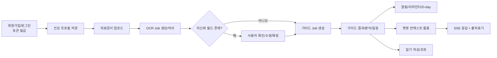

# AI Health 4인 스윔레인 (REQ/API 기준)

기준 문서:
- `docs/REQUIREMENTS_DEFINITION.md` (v1.32)
- `docs/API_SPECIFICATION.md` (v1.40)
- `docs/TEAM_DEVELOPMENT_GUIDELINE.md` (v2.31)

## 1) 역할(레인) 정의

| 레인 | 담당자 | 담당 범위 |
|---|---|---|
| Lane 1 | 프로필/회원/보안 | 인증/회원/프로필 + 접근제어/보안 정책 |
| Lane 2 | OCR | 의료문서 업로드/OCR 파이프라인/검수확정 |
| Lane 3 | 가이드/알림 | 가이드 생성/분석/일정 + 알림/리마인더 |
| Lane 4 | 챗봇 | 세션/메시지/SSE + 가드레일 + 근거기반 응답 |

## 2) 스윔레인 흐름 (핵심 핸드오프)

## 3) 레인별 상세 책임

### Lane 1. 프로필/회원/보안

담당 REQ:
- 인증/권한: `REQ-011`, `REQ-024~028`, `REQ-063~065`, `REQ-107~109`, `REQ-129~132`
- 공통 보안/추적: `REQ-105`, `REQ-111`, `REQ-135~136`

담당 API:
- `POST /api/v1/auth/signup`
- `POST /api/v1/auth/login`
- `POST /api/v1/auth/token/refresh`
- `POST /api/v1/auth/logout`
- `GET/PATCH/DELETE /api/v1/users/me`
- `PUT/GET /api/v1/users/me/health-profile`

핵심 산출물:
- JWT 인증/인가 미들웨어, 소유권 검증 규칙
- 로그아웃 JTI 블랙리스팅 + JWT 토큰 로테이션
- 회원 탈퇴 소프트 삭제(`is_active=false`) + 토큰 즉시 무효화
- 프로필 입력 평탄화 구조 저장 + 서버 계산 파생 지표(BMI 등)
- 프론트엔드 토큰 자동 갱신 + 사용자 전환 데이터 격리

핸드오프:
- Lane 2에 `user_id + health_profile + access_token` 기반 작업 가능 상태 전달

완료 기준(DoD):
- 보호 API 무토큰/타인토큰 접근 차단(401/403/404 정책 일관)
- 프로필 저장/조회 스키마가 API 명세와 일치

### Lane 2. OCR

담당 REQ:
- OCR 전체: `REQ-050~062`, `REQ-068~069`
- 관련 비기능: `REQ-114`, `REQ-116`, `REQ-118`, `REQ-120`, `REQ-124`, `REQ-126`

담당 API:
- `POST /api/v1/ocr/documents/upload`
- `POST /api/v1/ocr/jobs`
- `GET /api/v1/ocr/jobs/{job_id}`
- `GET /api/v1/ocr/jobs/{job_id}/result`
- `PATCH /api/v1/ocr/jobs/{job_id}/confirm`
- `GET /api/v1/medications/search`
- `GET /api/v1/medications/info`

핵심 산출물:
- 파일 유효성 검증(확장자/용량/손상, 10MB 제한)
- OCR 비동기 상태머신(`QUEUED -> PROCESSING -> SUCCEEDED/FAILED`)
- 저신뢰 필드 하이라이트 + 사용자 수정/확정 루프
- 원본 이미지 즉시 폐기(성공/실패/큐실패 포함, 이중 방어 로직)
- 약물 상세 정보 3-tier 폴백 (DB→공공API→LLM)
- ADHD 약물 DB(PsychDrug) 검색

핸드오프:
- Lane 3에 `ocr_job_id(SUCCEEDED)` + 구조화 처방 데이터 전달
- Lane 4에 챗봇 참고용 처방 컨텍스트 전달(읽기 전용)

완료 기준(DoD):
- OCR 결과 스키마(`raw_text`, `structured_data`) 충족
- 저신뢰 케이스가 검수 화면/확정 API로 연결

### Lane 3. 가이드/알림

담당 REQ:
- 가이드/분석/일정: `REQ-001~010`, `REQ-012~015`, `REQ-045~049`, `REQ-070`
- 알림/리마인더: `REQ-016~021`, `REQ-066~067`, `REQ-071~072`
- 일기: `REQ-073~074`
- 관련 비기능: `REQ-112`, `REQ-121`, `REQ-123`

담당 API:
- `POST /api/v1/guides/jobs`
- `GET /api/v1/guides/jobs/{job_id}`
- `GET /api/v1/guides/jobs/{job_id}/result`
- `POST /api/v1/guides/jobs/{job_id}/refresh`
- `GET /api/v1/analysis/summary`
- `GET /api/v1/schedules/daily`
- `PATCH /api/v1/schedules/items/{item_id}/status`
- `GET /api/v1/notifications`
- `GET /api/v1/notifications/unread-count`
- `PATCH /api/v1/notifications/{notification_id}/read`
- `PATCH /api/v1/notifications/read-all`
- `POST /api/v1/reminders`
- `GET /api/v1/reminders`
- `PATCH /api/v1/reminders/{reminder_id}`
- `DELETE /api/v1/reminders/{reminder_id}`
- `GET /api/v1/reminders/medication-dday`
- `DELETE /api/v1/notifications/read`
- `GET/PATCH /api/v1/notifications/settings`
- `PUT /api/v1/diaries/{diary_date}`
- `GET /api/v1/diaries/{diary_date}`
- `GET /api/v1/diaries`

핵심 산출물:
- 가이드 비동기 생성/상태/결과 API + 스냅샷 확정+생성(confirm-and-create)
- 분석 요약/위험 플래그/알러지 경고 생성
- 일정 이행률 및 일일 일정 상태 관리
- 가이드 완료 알림 + 리마인더 CRUD + D-day 계산
- 알림 설정(카테고리별 토글) + 읽은 알림 삭제
- 복약 5분 전 실시간 알림 생성(dose_text 포함)
- 일기 upsert/조회 API

핸드오프:
- Lane 4에 가이드 결과/분석 요약을 챗봇 참조 컨텍스트로 제공

완료 기준(DoD):
- 안전 고지/출처/이행률 필드 누락 없이 반환
- D-day 계산 정확도 테스트 통과

### Lane 4. 챗봇

담당 REQ:
- 챗봇 전체: `REQ-029~044`
- 관련 비기능: `REQ-115`, `REQ-117`, `REQ-123`, `REQ-125`, `REQ-128`

담당 API:
- `GET /api/v1/chat/prompt-options`
- `POST /api/v1/chat/sessions`
- `GET /api/v1/chat/sessions/{session_id}/messages`
- `POST /api/v1/chat/sessions/{session_id}/messages`
- `POST /api/v1/chat/sessions/{session_id}/stream`
- `DELETE /api/v1/chat/sessions/{session_id}`

핵심 산출물:
- 의도 분류(잡담/의학/위급), 위급 차단 가드레일
- 하이브리드 검색(Dense + Lexical) + 근거 문서 첨부
- SSE 스트리밍 및 메시지 상태머신(`PENDING -> STREAMING -> COMPLETED/FAILED/CANCELLED`)
- 비활성 세션 자동 종료 및 세션 삭제 처리

핸드오프:
- Lane 3 결과(가이드/분석)와 Lane 2 결과(처방)를 읽어 컨텍스트 보강

완료 기준(DoD):
- 위급 질의에서 LLM 차단 + 정책 문구 고정 응답
- 저유사도 질문에 재질문 유도(`needs_clarification`)

## 4) 실행 순서(권장)

1. Lane 1 선행 구축: 인증/보안 + 프로필 API
2. Lane 2 핵심 경로 구축: 업로드 -> OCR -> 확정
3. Lane 3 구축: 가이드/분석/일정 + 알림 + 일기
4. Lane 4 구축: 챗봇 세션/스트리밍/가드레일
5. 공통 회귀: 권한/상태전이/에러매핑/성능(P95) 검증

## 5) 주간 운영 규칙 (4인 협업)

- PR 필수 항목: `관련 REQ ID`, `변경 API`, `테스트 결과`, `문서 동기화 여부`
- 인터페이스 고정: API 계약 변경 시 4개 레인 동시 공지 후 일괄 반영
- 교차 리뷰:
  - Lane 1 <-> Lane 2: 인증/소유권/OCR 접근 경계
  - Lane 2 <-> Lane 3: OCR 결과 스키마/가이드 입력 계약
  - Lane 3 <-> Lane 4: 가이드/분석 컨텍스트 참조 계약
- 통합 점검: `ruff`, `mypy`, `pytest` 통과 + E2E 시나리오 1회 이상
